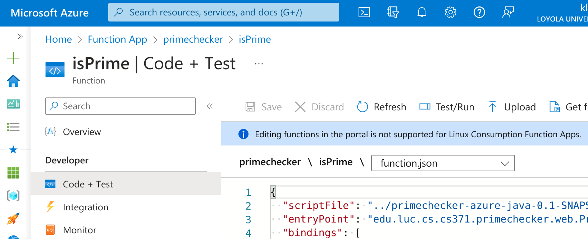
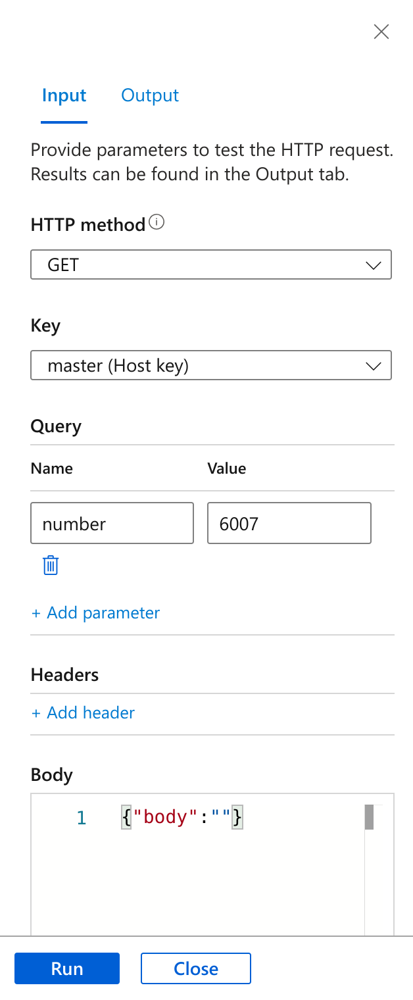
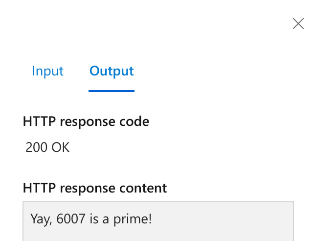

## primechecker-azure-java

An Azure Function implemented in Java for checking whether or not a number is prime.

## Build status

- Dynamic  

- Structural  

- Other  

## Learning objectives

- Show how CPU-intensive computation can be off-loaded from a mobile app to
  the cloud, by comparison to a mobile device, an unlimited resource for
  computation and storage.

- End-to-end example of continuous integration (CI), continuous
  deployment/delivery (CD), and DevOps in Java using Azure Functions.

See also the
[corresponding mobile app](https://github.com/LoyolaChicagoCode/primenumbers-android-scala).

## How to use

To use, put the number to be checked in the query string of the deployed function, e.g.

    https://primechecker.azurewebsites.net/api/isPrime?number=7

### Some sample primes to try

- [1013](https://primechecker.azurewebsites.net/api/isPrime?number=1013)
- [10007](https://primechecker.azurewebsites.net/api/isPrime?number=10007)
- [100003](https://primechecker.azurewebsites.net/api/isPrime?number=100003)
- [1000003](https://primechecker.azurewebsites.net/api/isPrime?number=1000003)
- [10000169](https://primechecker.azurewebsites.net/api/isPrime?number=10000169)
- [100000007](https://primechecker.azurewebsites.net/api/isPrime?number=100000007)
- [1000000000169](https://primechecker.azurewebsites.net/api/isPrime?number=1000000000169)
- [100000000000169](https://primechecker.azurewebsites.net/api/isPrime?number=100000000000169)

### Some non-primes to try

- [999989](https://primechecker.azurewebsites.net/api/isPrime?number=999989)
- [Long.MAX_VALUE](https://primechecker.azurewebsites.net/api/isPrime?number=9223372036854775807)
- [10000000000000000169](https://primechecker.azurewebsites.net/api/isPrime?number=10000000000000000169)
- [2 * Long.MAX_VALUE + 3](https://primechecker.azurewebsites.net/api/isPrime?number=18446744073709551617)

## Development

### Prerequisites

See [Quickstart: Create a Java function in Azure from the command line](https://learn.microsoft.com/en-us/azure/azure-functions/create-first-function-cli-java).

### Building and testing locally

Test with

    $ mvn test

Run locally with

    $ mvn azure-functions:run

and use via the provided local URLs.

### Managing via the Azure portal

Visit the [Function App](https://portal.azure.com/#view/HubsExtension/BrowseResource/resourceType/Microsoft.Web%2Fsites/kind/functionapp) section of the Azure portal.

A function app can have one or more functions.
Drill into a specific function:

    Home > Function App > primechecker > isPrime

In it's *Code + Test* section, you can verify the mapping between the function's published entry point and the corresponding method implementation:

    "entryPoint": "edu.luc.cs.cs371.primechecker.web.PrimeCheckerFunction.run",

There, you can press the *Test/Run* button to interact directly with the function:

## References

- [Jason Christensen's OOPSLA 2009 presentation](http://www.slideshare.net/jasonc411/oopsla-2009-combining-rest-and-cloud-a-practitioners-report)
- [James Earl Douglas's SBTB 2014 presentation](https://www.youtube.com/watch?v=sZYAFWTyOlE)
- [Quickstart: Create a Java function in Azure from the command line](https://learn.microsoft.com/en-us/azure/azure-functions/create-first-function-cli-java)
